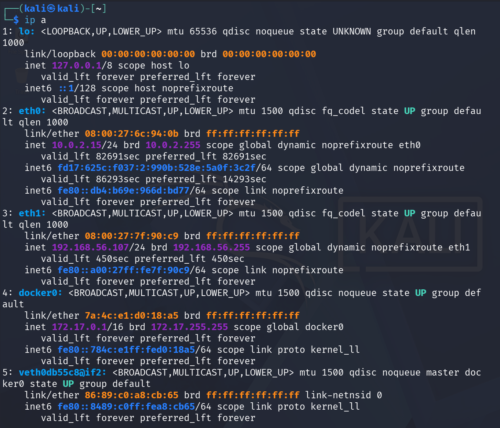
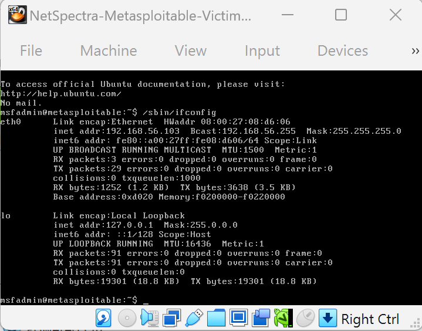
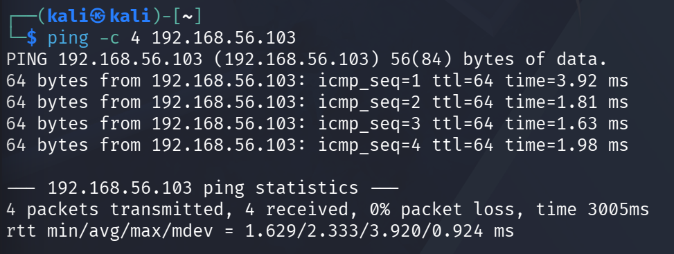
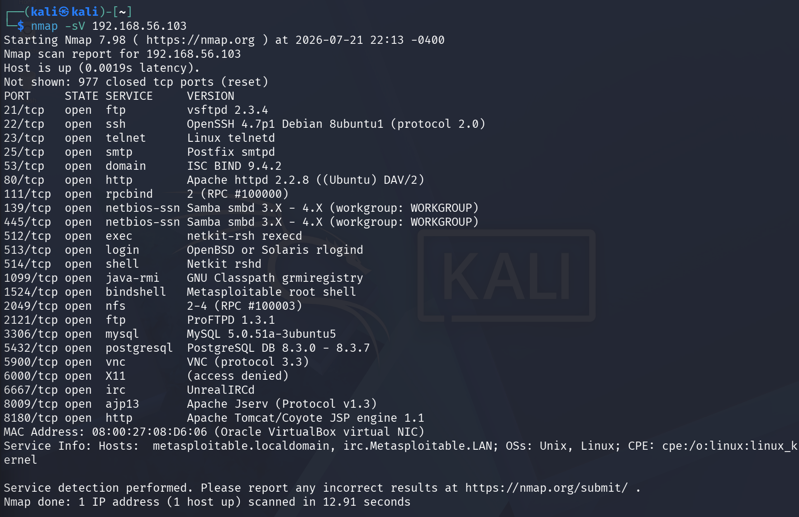
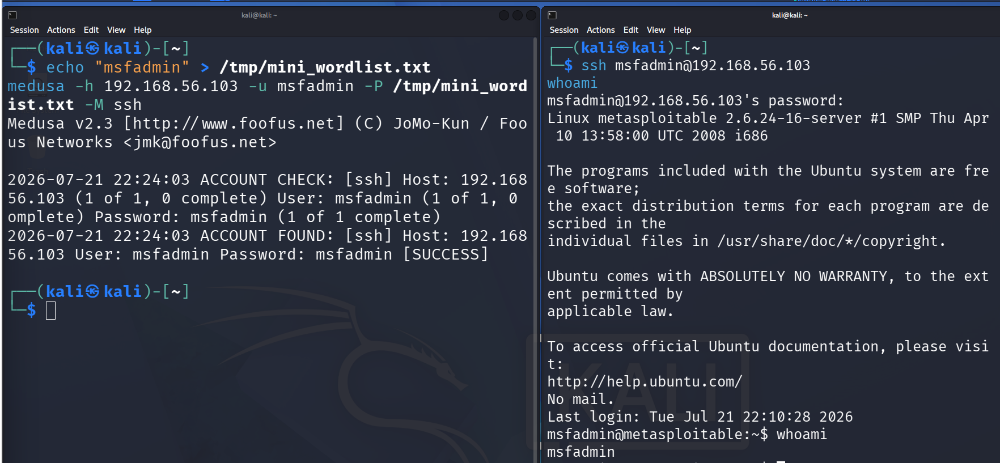
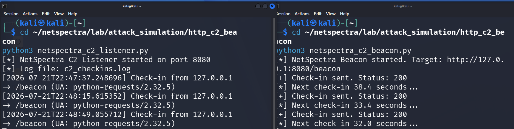
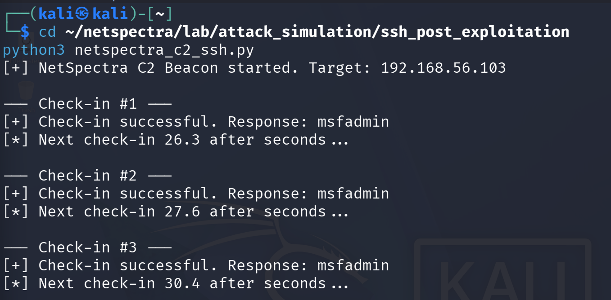
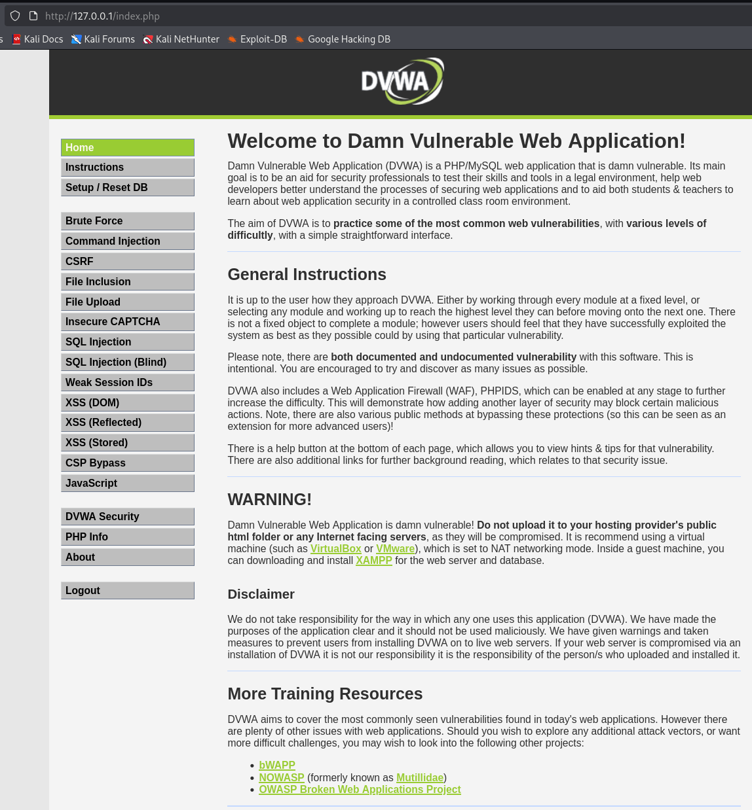

<div align="center">

# NetSpectra

### SOC Network Threat Detection Platform with MITRE ATT&CK Mapping & Compliance Translation (NIST CSF, ISO27001, NIS2, DORA)

*"Decode Network Behavior. Reveal Hidden Threats."*

</div>

<div align="center">


</div>

<div align="center">


</div>

---

## The Problem It Solves

Modern SOC teams face one core challenge: finding real threats among thousands of daily network events. **NetSpectra** is a network threat detection and intelligence platform built to solve exactly that, through:

- Network Traffic Visibility & Behavioral Baselining - Full Zeek-based visibility with learned baselines to separate normal from suspicious.
- Detection Engineering with Validation - Python & Sigma-based detections for network threats, each backed by a validation harness (true/false positive PCAPs) to prove reliability.
- False Positive Reduction at Scale - Stateful alert correlation (15-min window, same src + technique = 1 alert) and explainable risk scoring to kill alert fatigue, not just detect.
- Threat Intelligence Enrichment - Automatic VirusTotal / AbuseIPDB / OTX enrichment with transparent risk breakdown.
- MITRE ATT&CK Mapping with Compliance Translation - Every alert mapped to a MITRE ATT&CK technique and automatically translated to NIST CSF, ISO 27001:2022, NIS2, and DORA controls for audit-ready reporting.
- Evidence-Based Incident Investigation - One-click evidence bundle: alert + related Zeek logs + sliced PCAP + MITRE & compliance mapping, ready for L1 investigation.

---

## Codebase at a Glance

```
NetSpectra/
├── backend/
│   ├── api/
│   ├── collectors/
│   ├── analyzers/
│   ├── detection_engine/
│   ├── sigma_rules/
│   ├── mitre/
│   ├── risk_engine/
│   ├── baselining/
│   ├── alerting/
│   └── threat_intel/
├── dashboard/
├── lab/
│   └── attack_simulation/
│       ├── http_c2_beacon/
│       │   ├── netspectra_c2_listener.py
│       │   └── netspectra_c2_beacon.py
│       └── ssh_post_exploitation/
│           └── netspectra_c2_ssh.py
├── data/
│   ├── pcaps/
│   └── zeek_logs/
├── tests/
├── reports/
├── screenshots/
│   └── L0/
├── docs/
│   └── L0_technical_report.md
├── docker-compose.yml
├── requirements.txt
└── README.md
```

---

## Detection Engineering Maturity

---

### L0 - Lab & Attack Simulation `COMPLETE`

> **Goal:** Build a reproducible, isolated purple-team lab to generate ground-truth attack traffic for Zeek & Sigma detections.
> **Outcome:** 4 MITRE ATT&CK techniques (T1046, T1110, T1021, T1071.001) fully simulated with labeled PCAPs for L3.
> **Stack:** VirtualBox · Kali Linux · Metasploitable2 · Windows 11 · Docker (DVWA) · Python · Zeek · paramiko

#### Lab Infrastructure

| Component | IP | Role |
|:---|:---|:---|
| NetSpectra-Kali-Attacker | 192.168.56.107 | Attacker — nmap 7.98, medusa 2.3, hydra, custom C2 |
| NetSpectra-Metasploitable-Victim | 192.168.56.103 | Network target — 24 open services (SSH, FTP, HTTP, SMB...) |
| NetSpectra-Win11-Victim | 192.168.56.104 | Windows attack surface |
| DVWA (Docker on Kali) | 127.0.0.1:80 | Web target — SQLi, XSS, Command Injection, Brute Force |

**Network:** VirtualBox Host-only Adapter `192.168.56.0/24` — fully isolated, zero internet exposure. Kali dual-homed: `eth0` NAT (tooling/updates) + `eth1` Host-only (attack traffic). Every packet in the lab is intentional.

#### Attack Simulations

| Technique | Tool | MITRE | Result | L3 Signal |
|:---|:---|:---|:---|:---|
| Network Recon | nmap -sV | T1046 | 24 open ports discovered | Single src → 24 dst ports in seconds (conn.log) |
| SSH Brute Force | medusa 2.3 | T1110.001 | `msfadmin:msfadmin` cracked | Auth flood + 1 success (ssh.log) |
| SSH Post-Exploitation | paramiko (custom C2) | T1021 | Authenticated shell, periodic check-ins | Periodic SSH sessions with jitter (conn.log) |
| HTTP C2 Beaconing | Custom Python beacon | T1071.001 | Listener confirmed, 200 OK per check-in | Periodic HTTP GET with jitter + UA anomaly (http.log) |

**Engineering note on T1110:** `hydra` failed with `libssh error` — Metasploitable runs OpenSSH 4.7p1 with legacy KEX algorithms dropped by modern libssh. Switched to `medusa 2.3` which implements its own SSH client. Lesson: tool compatibility with legacy infrastructure is a real constraint in production engagements.

#### Custom C2 — Two Protocols, Two Detections

**SSH C2 (`netspectra_c2_ssh.py`):**
- Periodic SSH check-ins every `30 ± 10s` (jitter — mirrors real C2 frameworks: Cobalt Strike, Sliver)
- Lightweight `whoami` each check-in; deep recon (`id`, `hostname`, `uname -a`) every 5th check-in
- Jitter forces statistical detection, not simple interval matching — exactly what L3 will validate

**HTTP C2 (`netspectra_c2_listener.py` + `netspectra_c2_beacon.py`):**
- Beacon: `GET /beacon` every `30 ± 10s` → logs to `beacon_sent.log` (ground truth for L3)
- Listener: logs `timestamp + client_ip + endpoint + User-Agent` → `c2_checkins.log`
- User-Agent logged because anomalous UA strings are a primary HTTP C2 detection signal
- `beacon_sent.log` vs Zeek `http.log` comparison in L3 proves detection latency near-zero

#### Evidence


*Kali dual-interface setup - eth0 NAT + eth1 Host-only lab network*


*Metasploitable confirmed at 192.168.56.103 - 24 services running*


*Kali → Metasploitable: 0% packet loss - lab isolation confirmed*


*T1046 - 24 open ports with service versions*


*T1110.001 - medusa cracks msfadmin:msfadmin + authenticated shell via SSH*


*T1071.001 - listener + beacon confirmed, check-ins with jitter visible*


*T1021 - periodic SSH check-ins, deep recon on 5th interval*


*Web attack surface deployed - SQL injection, XSS, command injection ready*

> 📄 Full technical write-up including all engineering decisions, network diagrams, and troubleshooting: [docs/L0_technical_report.md](docs/L0_technical_report.md)

---

###  L1 - Traffic Collection `IN PROGRESS`

- [ ] `tcpdump` integration for live traffic capture
- [ ] Centralized PCAP storage pipeline (auto-labeled by attack type + timestamp)
- [ ] Wireshark-based traffic validation
- [ ] Zeek deployment for rich network metadata

---

###  L2 - Structured Data `PLANNED`

- [ ] Zeek log parsing (`conn`, `dns`, `http`, `ssl`, `files`)
- [ ] Event normalization and enrichment
- [ ] PostgreSQL storage for long-term analysis
- [ ] Auto-learning behavioral baselining engine

---

###  L3 - Signal Detection `PLANNED`

- [ ] Network Recon Detection (T1046 — Port Scan)
- [ ] Brute Force Detection (T1110)
- [ ] C2 Beacon Detection (T1071)
- [ ] DNS Tunneling Detection (T1071.004)
- [ ] Sigma Rules correlation engine + Suricata IDS integration
- [ ] Detection Validation Harness — each rule has `true_positive.pcap` / `false_positive.pcap` and `pytest` auto-validation to prove detection efficacy and eliminate false positives

---

###  L4 - Contextual Intelligence `PLANNED`

- [ ] Threat Intelligence enrichment (VirusTotal, AbuseIPDB, OTX AlienVault)
- [ ] IP Whitelisting engine with behavior model
- [ ] Stateful Alert Correlation — 15-min sliding window, same `src_ip` + technique = 1 correlated alert (alert fatigue killer)
- [ ] Explainable Risk Scoring — transparent breakdown e.g. `65% beacon interval + 20% VT malicious + 15% new dst` (no black-box scores)
- [ ] MITRE ATT&CK mapping
- [ ] Compliance Translation Layer — automatic mapping: `MITRE Technique → NIST CSF / ISO 27001:2022 / NIS2 / DORA` via `compliance_mapping.yml`
- [ ] Real-time alert notifications (Slack / Email)

---

###  L5 - Operational Readiness `PLANNED`

- [ ] SOC Dashboard with security metrics & risk explanation
- [ ] Deep Investigation View
- [ ] One-Click Evidence Bundle — single ZIP: `alert.json` + correlated Zeek logs + sliced PCAP + MITRE + compliance mapping
- [ ] Compliance View — filter by NIS2 Art. 20 / DORA ICT / NIST CSF DE.CM, export audit-ready CSV/PDF
- [ ] MITRE ATT&CK Navigator export with coverage heatmap
- [ ] Full Docker deployment
- [ ] Documentation & Demo Video
- [ ] GitHub public release

---

## Tech Stack

| Layer | Tools |
|---|---|
| Attack Simulation | Kali Linux, Nmap, Hydra, Custom C2 Scripts |
| Traffic Collection | tcpdump, Wireshark, Zeek |
| Storage | PostgreSQL |
| Detection Engine | Sigma Rules, Suricata IDS, Custom Python engine |
| Testing & Validation | pytest, Scapy (pcap crafting), Validation Harness (true/false PCAP suite) |
| Risk & Correlation | Custom Correlation Engine (stateful, 15-min window), Explainable Scoring Engine |
| Threat Intelligence | VirusTotal, AbuseIPDB, OTX AlienVault |
| Framework Mapping | MITRE ATT&CK v14 |
| Compliance Layer | compliance_mapping.yml, NIST CSF, ISO 27001:2022, NIS2, DORA (translation layer) |
| Evidence & Investigation | Evidence Bundler (ZIP + sliced PCAP + Zeek logs) |
| Alerting | Slack, Email |
| Visualization & Export | SOC Dashboard, MITRE ATT&CK Navigator, Compliance Coverage Reports (CSV/PDF) |
| Deployment | Docker, Docker Compose |


## 👤 Author

**Khayal Kocharili**
Computer Science Student specializing in Cybersecurity · Otto-von-Guericke University Magdeburg
[GitHub](https://github.com/KhayalKoch)

> Building NetSpectra — SOC Network Threat Detection Platform with MITRE ATT&CK Mapping & Compliance Translation