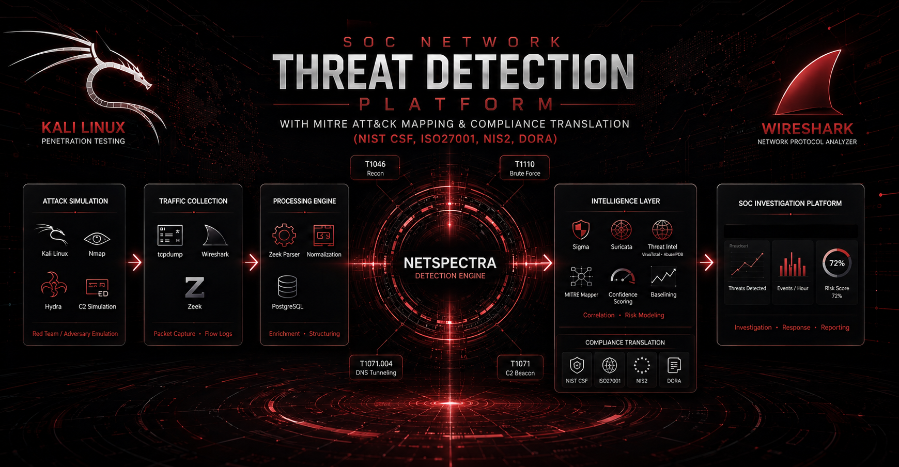

<div align="center">

# NetSpectra

### SOC Network Threat Detection Platform with MITRE ATT&CK Mapping & Compliance Translation (NIST CSF, ISO27001, NIS2, DORA)

*"Decode Network Behavior. Reveal Hidden Threats."*

</div>

<div align="center">


</div>

<div align="center">



</div>

---

## The Problem It Solves

Modern SOC teams face one core challenge: finding real threats among thousands of daily network events. **NetSpectra** is a network threat detection and intelligence platform built to solve exactly that, through:

- Network Traffic Visibility & Behavioral Baselining - Full Zeek-based visibility with learned baselines to separate normal from suspicious.
- Detection Engineering with Validation - Python & Sigma-based detections for network threats, each backed by a validation harness (true/false positive PCAPs) to prove reliability.
- False Positive Reduction at Scale - Stateful alert correlation (15-min window, same src + technique = 1 alert) and explainable risk scoring to kill alert fatigue, not just detect.
- Threat Intelligence Enrichment - Automatic VirusTotal / AbuseIPDB / OTX enrichment with transparent risk breakdown.
- MITRE ATT&CK Mapping with Compliance Translation - Every alert mapped to a MITRE ATT&CK technique and automatically translated to NIST CSF, ISO 27001:2022, NIS2, and DORA controls for audit-ready reporting.
- Evidence-Based Incident Investigation - One-click evidence bundle: alert + related Zeek logs + sliced PCAP + MITRE & compliance mapping, ready for L1 investigation.

---

## Codebase at a Glance

```
NetSpectra/
├── backend/
│   ├── api/
│   ├── collectors/
│   ├── analyzers/
│   ├── detection_engine/
│   ├── sigma_rules/
│   ├── mitre/
│   ├── risk_engine/
│   ├── baselining/
│   ├── alerting/
│   └── threat_intel/
├── dashboard/
├── lab/
├── data/
├── tests/
├── reports/
├── screenshots/
├── docs/
├── docker-compose.yml
├── requirements.txt
└── README.md
```

---

## Detection Engineering Maturity

### L0 - Lab & Attack Simulation
- Kali Linux attacker machine provisioning
- Vulnerable targets deployment (DVWA, Metasploitable, etc.)
- Dockerized isolated lab network
- Attack simulation setup (Nmap, Hydra, custom C2 scripts)

### L1 - Traffic Collection
- tcpdump integration for live traffic capture
- Centralized PCAP storage pipeline
- Wireshark-based traffic validation
- Zeek deployment for rich network metadata

### L2 - Structured Data
- Zeek log parsing (conn, dns, http, ssl, files)
- Event normalization and enrichment
- PostgreSQL storage for long-term analysis
- Auto-learning behavioral baselining engine

### L3 - Signal Detection
- Network Recon Detection (T1046 – Port Scan)
- Brute Force Detection (T1110)
- C2 Beacon Detection (T1071)
- DNS Tunneling Detection (T1071.004)
- Sigma Rules correlation engine + Suricata IDS integration
- Detection Validation Harness - each rule has `true_positive.pcap` / `false_positive.pcap` and `pytest` auto-validation to prove detection efficacy and reduce FP

### L4 - Contextual Intelligence
- Threat Intelligence enrichment (VirusTotal, AbuseIPDB, OTX)
- IP Whitelisting engine with behavior model
- Stateful Alert Correlation - 15-min sliding window, same `src_ip` + technique = 1 correlated alert (alert fatigue killer)
- Explainable Risk Scoring - score breakdown, e.g. `65% beacon interval + 20% VT malicious + 15% new dst`, instead of a black-box score
- MITRE ATT&CK mapping
- Compliance Translation Layer - automatic mapping: `MITRE Technique → NIST CSF / ISO 27001:2022 / NIS2 / DORA` via `compliance_mapping.yml`
- Real-time alert notifications (Slack / Email)

### L5 - Operational Readiness (Dashboard & Release)
- SOC Dashboard with security metrics & risk explanation
- Deep Investigation View
- One-Click Evidence Bundle - single ZIP: `alert.json` + correlated Zeek logs + sliced PCAP + MITRE + compliance mapping
- Compliance View - filter by NIS2 Art. 20 / DORA ICT / NIST CSF DE.CM and export audit-ready CSV/PDF
- MITRE ATT&CK Navigator export with coverage heatmap
- Full Docker deployment
- Documentation & Demo Video
- GitHub public release

---

## Tech Stack

| Layer | Tools |
|---|---|
| Attack Simulation | Kali Linux, Nmap, Hydra, Custom C2 Scripts |
| Traffic Collection | tcpdump, Wireshark, Zeek |
| Storage | PostgreSQL |
| Detection Engine | Sigma Rules, Suricata IDS, Custom Python engine |
| Testing & Validation | pytest, Scapy (pcap crafting), Validation Harness (true/false PCAP suite) |
| Risk & Correlation | Custom Correlation Engine (stateful, 15-min window), Explainable Scoring Engine |
| Threat Intelligence | VirusTotal, AbuseIPDB, OTX AlienVault |
| Framework Mapping | MITRE ATT&CK v14 |
| Compliance Layer | compliance_mapping.yml, NIST CSF, ISO 27001:2022, NIS2, DORA (translation layer) |
| Evidence & Investigation | Evidence Bundler (ZIP + sliced PCAP + Zeek logs) |
| Alerting | Slack, Email |
| Visualization & Export | SOC Dashboard, MITRE ATT&CK Navigator, Compliance Coverage Reports (CSV/PDF) |
| Deployment | Docker, Docker Compose |


## 👤 Author

**Khayal Kocharili**
Computer Science Student specializing in Cybersecurity · Otto-von-Guericke University Magdeburg
[GitHub](https://github.com/KhayalKoch) · Building NetSpectra - SOC Network Threat Detection Platform with MITRE ATT&CK Mapping & Compliance Translation