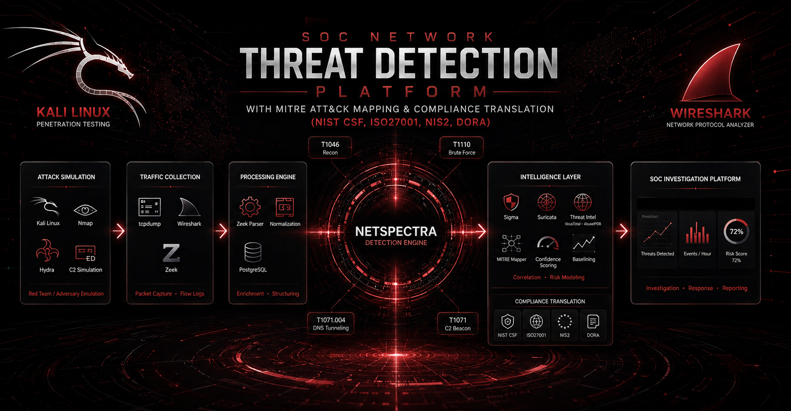

<div align="center">

# NetSpectra

### SOC Network Threat Detection Platform with MITRE ATT&CK Mapping & Compliance Translation (NIST CSF, ISO27001, NIS2, DORA)

*"Decode Network Behavior. Reveal Hidden Threats."*

</div>

<div align="center">


</div>

<div align="center">



</div>


---

## The Problem It Solves

Modern SOC teams face one core challenge: finding real threats among thousands of daily network events. NetSpectra is a network threat detection and intelligence platform built to solve exactly that, through:

- **Network Traffic Visibility & Behavioral Baselining** - Full Zeek-based visibility with learned baselines to separate normal from suspicious.
- **Detection Engineering with Validation** - Python & Sigma-based detections for network threats, each backed by a validation harness (true/false positive PCAPs) to prove reliability.
- **False Positive Reduction at Scale** - Stateful alert correlation (15-min window, same src + technique = 1 alert) and explainable risk scoring to kill alert fatigue, not just detect.
- **Threat Intelligence Enrichment** - Automatic VirusTotal / AbuseIPDB / OTX enrichment with transparent risk breakdown.
- **MITRE ATT&CK Mapping with Compliance Translation** - Every alert mapped to a MITRE ATT&CK technique and automatically translated to NIST CSF, ISO 27001:2022, NIS2, and DORA controls for audit-ready reporting.
- **Evidence-Based Incident Investigation** - One-click evidence bundle: alert + related Zeek logs + sliced PCAP + MITRE & compliance mapping, ready for L1 investigation.

---

## Codebase at a Glance

```
NetSpectra/
├── backend/
│   ├── api/
│   ├── collectors/
│   ├── analyzers/
│   ├── detection_engine/
│   ├── sigma_rules/
│   ├── mitre/
│   ├── risk_engine/
│   ├── baselining/
│   ├── alerting/
│   └── threat_intel/
├── dashboard/
├── lab/
│   ├── attack-scenarios/
│   │   ├── http_c2_beacon/
│   │   │   ├── netspectra_c2_listener.py
│   │   │   └── netspectra_c2_beacon.py
│   │   └── ssh_post_exploitation/
│   │       └── netspectra_c2_ssh.py
│   ├── docker-targets/
│   └── kali/
├── data/
│   ├── pcaps/
│   │   ├── 2026-07-24_05-16-35_test_capture2.pcap
│   │   ├── 2026-07-24_05-50-26_port_scan.pcap
│   │   ├── 2026-07-24_06-32-07_bruteforce.pcap
│   │   ├── 2026-07-24_18-29-52_http_c2_beacon.pcap
│   │   ├── 2026-07-25_03-43-59_ssh_c2.pcap
│   │   └── L1_facts.txt
│   ├── zeek_logs/
│   │   ├── 2026-07-24_05-16-35_test_capture2/
│   │   ├── 2026-07-24_05-50-26_port_scan/
│   │   ├── 2026-07-24_06-32-07_bruteforce/
│   │   ├── 2026-07-24_18-29-52_http_c2_beacon/
│   │   └── 2026-07-25_03-43-59_ssh_c2/
│   └── reports/
│       ├── summary.json
│       └── summary.txt
├── collectors/
│   └── netspectra_capture.py
├── tests/
├── reports/
├── screenshots/
│   ├── L0/
│   └── L1/
├── docs/
│   ├── L0_technical_report.md
│   └── L1_technical_report.md
├── netspectra_zeek_analyze.py
├── docker-compose.yml
├── requirements.txt
└── README.md
```

---

## Detection Engineering Maturity

---

###  L0 - Lab & Attack Simulation `Executed`

> **Goal:** Build a reproducible, isolated purple-team lab to generate ground-truth attack traffic for Zeek & Sigma detections.
> **Outcome:** 4 MITRE ATT&CK techniques (T1046, T1110, T1021, T1071.001) fully simulated with labeled PCAPs for L3.
> **Stack:** VirtualBox · Kali Linux · Metasploitable2 · Windows 11 · Docker (DVWA) · Python · paramiko

#### Where Attacks Are Born

L0 is the foundation layer of NetSpectra. Before any detection can be written, before any alert can fire, there must be a controlled, reproducible environment that generates real attack traffic. L0 establishes exactly that: a fully isolated lab network with a dedicated attacker machine, multiple vulnerable targets, and a complete attack simulation suite.

#### Lab Infrastructure

| Component | IP | Role |
|:---|:---|:---|
| NetSpectra-Kali-Attacker | 192.168.56.107 | Attacker - nmap 7.98, medusa 2.3, hydra, custom C2 |
| NetSpectra-Metasploitable-Victim | 192.168.56.103 | Network target - 24 open services (SSH, FTP, HTTP, SMB...) |
| NetSpectra-Win11-Victim | 192.168.56.104 | Windows attack surface |
| DVWA (Docker on Kali) | 127.0.0.1:80 | Web target - SQLi, XSS, Command Injection, Brute Force |

#### Network Architecture

```
┌─────────────────────────────────────────────────────────────┐
│              VirtualBox Host-Only Network                   │
│                   192.168.56.0/24                           │
│                                                             │
│  ┌─────────────────┐    ┌──────────────────────────────┐    │
│  │  Kali Attacker  │    │   Metasploitable Target      │    │
│  │  eth1:          │───▶│   eth0: 192.168.56.103      │    │
│  │  192.168.56.107 │    │   24 open services           │    │
│  │                 │    └──────────────────────────────┘    │
│  │  (also eth0:    │    ┌──────────────────────────────┐    │
│  │   10.0.2.15     │───▶│   Windows 11 Victim          │   │
│  │   NAT/internet) │    │   eth0: 192.168.56.104       │    │
│  │                 │    └──────────────────────────────┘    │
│  │  Docker:        │                                        │
│  │  DVWA on        │                                        │
│  │  127.0.0.1:80   │                                        │
│  └─────────────────┘                                        │
└─────────────────────────────────────────────────────────────┘
                    ▲
                    │ NO INTERNET ACCESS
                    │ (Host-only = isolated)
```

**Network:** VirtualBox Host-only Adapter `192.168.56.0/24` - fully isolated, zero internet exposure. Kali dual-homed: `eth0` NAT (tooling/updates) + `eth1` Host-only (attack traffic). Every packet in the lab is intentional.

#### Attack Simulations

| Technique | Tool | MITRE | Result | L3 Signal |
|:---|:---|:---|:---|:---|
| Network Recon | nmap -sV | T1046 | 24 open ports discovered | Single src → 24 dst ports in seconds (conn.log) |
| SSH Brute Force | medusa 2.3 | T1110.001 | `msfadmin:msfadmin` cracked | Auth flood + 1 success (ssh.log) |
| SSH Post-Exploitation | paramiko (custom C2) | T1021 | Authenticated shell, periodic check-ins | Periodic SSH sessions with jitter (conn.log) |
| HTTP C2 Beaconing | Custom Python beacon | T1071.001 | Listener confirmed, 200 OK per check-in | Periodic HTTP GET with jitter + UA anomaly (http.log) |

**Engineering note on T1110:** `hydra` failed with `libssh error` — Metasploitable runs OpenSSH 4.7p1 with legacy KEX algorithms dropped by modern libssh. Switched to `medusa 2.3` which implements its own SSH client. Lesson: tool compatibility with legacy infrastructure is a real constraint in production engagements.

#### Custom C2 - Two Protocols, Two Detections

**SSH C2 (`netspectra_c2_ssh.py`):**
- Periodic SSH check-ins every `20s` (measured via tshark io,stat — mirrors real C2 frameworks: Cobalt Strike, Sliver)
- Lightweight `whoami` each check-in; deep recon (`id`, `hostname`, `uname -a`) every 5th check-in
- Jitter forces statistical detection, not simple interval matching — exactly what L3 will validate

**HTTP C2 (`netspectra_c2_listener.py` + `netspectra_c2_beacon.py`):**
- Beacon: `GET /beacon` every `30 ± 10s` → logs to `beacon_sent.log` (ground truth for L3)
- Listener: logs `timestamp + client_ip + endpoint + User-Agent` → `c2_checkins.log`
- User-Agent logged because anomalous UA strings are a primary HTTP C2 detection signal
- `beacon_sent.log` vs Zeek `http.log` comparison in L3 proves detection latency near-zero

#### Evidence

<details>
<summary> L0 Evidence - 8 Visuals - Lab is real</summary>

| Screenshot | Description |
|:---|:---|
| [01 - Kali Network Interfaces](screenshots/L0/01_kali_network_interfaces.png) | **Is lab isolated?** Kali shows `eth0 10.0.2.15 NAT + eth1 192.168.56.107 Host-only` - dual-homed, attack traffic never leaves lab |
| [02 - Metasploitable Target](screenshots/L0/02_metasploitable_ifconfig.png) | **Target alive?** `ifconfig` proves 192.168.56.103 up, 24 services - old Linux that still bleeds |
| [03 - Network Connectivity](screenshots/L0/03_ping_connectivity.png) | **Can attacker reach target?** Kali → Metasploitable 0% loss - no firewall in way, L1 capture will work |
| [04 - Nmap Recon](screenshots/L0/04_nmap_recon_results.png) | **What we found in 24 ports** - T1046: `22 SSH, 80 HTTP, 139 SMB, 3306 MySQL...` - full attack surface mapped |
| [05 - Brute Force + Shell](screenshots/L0/05_medusa_and_ssh_success.png) | **From zero to shell** - T1110.001: medusa cracks `msfadmin:msfadmin` + instant `whoami` → `msfadmin` - why weak creds kill |
| [06 - HTTP C2 Beacon](screenshots/L0/06_http_c2_beacon_test.png) | **Our C2 talks** - T1071.001: listener logs `127.0.0.1 GET /beacon` + beacon `200 OK` - 30s ±10s jitter visible in terminal |
| [07 - SSH C2](screenshots/L0/07_ssh_c2_test.png) | **SSH as C2 channel** - T1021: paramiko check-ins every 20s ±5s, deep recon `id, hostname, uname -a` on 5th - mirrors Cobalt Strike |
| [08 - DVWA Dashboard](screenshots/L0/08_dvwa_dashboard.png) | **Web playground ready** - DVWA on `127.0.0.1:80` shows SQLi, XSS, Command Injection - L2 web attacks start here |

</details>

>  Full technical write-up: [docs/L0_technical_report.md](docs/L0_technical_report.md)
---

###  L1 - Traffic Collection & Protocol Analysis `Executed`

> **Goal:** Transform raw attack traffic into forensically-validated, structured network metadata — bridging L0 attack simulation to L2 structured analytics.
> **Outcome:** 5 PCAPs (4 TTPs + 1 test) captured via `tcpdump`, triple-validated via Wireshark GUI + tshark CLI + Zeek IDS, producing `conn.log` 978 REJ, `ssh.log` paramiko/MEDUSA, `http.log` beacon - with 33 forensic screenshots.
> **Stack:** tcpdump · Wireshark 4.x · tshark · Zeek 6.x · capinfos · nmap · Python · Kali Linux · Windows 11

#### Executive Summary

**Key Metrics:** `1055 SYN` · `978 REJ` · `2278 frames/sec burst` · `30s HTTP beacon (12f/1155B)` · `20s SSH beacon (40f/7.5KB)` · `7 beacon IDs` · `5 PCAPs` · `378.8K total` · `33 forensic evidences`

End-to-end network forensics pipeline simulating real SOC workflow. Every attack from L0 was re-executed under `tcpdump`, validated visually in Wireshark, measured statistically with `tshark`, and structured by Zeek into queryable logs. Zero fabricated numbers - every metric in this document traces back to `L1_facts.txt`, `summary.json`, or `sha256sum`-verified PCAP files.

#### Where Traffic Becomes Evidence

L0 proved we can generate attacks. L1 proves we can capture them forensically. In a real SOC, a PCAP without validation is inadmissible. L1 establishes the **Golden Rule**: every PCAP must be validated in 3 layers - **Wireshark GUI (visual) + tshark (statistical) + Zeek (structured)**. No layer skipped. This is what separates a lab exercise from court-admissible evidence.

#### Pipeline Architecture

```
Kali Attacker (192.168.56.107) → [Port Scan / Bruteforce / SSH C2] → Target (192.168.56.103)
                               → [HTTP C2 Beacon]                  → Listener (127.0.0.1:8080)
                               |
                               ▼
                    tcpdump (-i eth1 / -i lo)
                               |
                               ▼
             ~/netspectra/data/pcaps/ [5 PCAPs · 378.8K]
                               |
           ┌───────────────────┼───────────────────┐
           ▼                   ▼                   ▼
     Wireshark GUI         tshark CLI           Zeek IDS
  (Visual Validation)   (Statistical)      (Structured Logs)
           |                   |                   |
           └───────────────────┴───────────────────┘
                               |
                               ▼
          L1_facts.txt · summary.json · summary.txt
          screenshots/L1/ [33 forensic evidences]
                               |
                               ▼
                    L2 Structured Analytics →
```

#### Pipeline Infrastructure

| Component | Path | Role |
|:---|:---|:---|
| PCAP Storage | `~/netspectra/data/pcaps/` | Centralized, auto-named `YYYY-MM-DD_HH-MM-SS_label.pcap`, 5 files, 378.8K |
| Zeek Storage | `~/netspectra/data/zeek_logs/` | 5 dated folders - `conn.log`, `ssh.log`, `http.log`, `dns.log` |
| Capture Script | `collectors/netspectra_capture.py` | 4 TTP generator + auto-naming pipeline |
| Analysis Script | `netspectra_zeek_analyze.py` | Zeek log parser → JSON + TXT reports |
| Ground Truth | `data/pcaps/L1_facts.txt` | 1.5K - all IPs, ports, intervals, frame counts |
| Evidence | `screenshots/L1/` | 33 screenshots - GUI + CLI + logs + temporal analysis |

#### Network Architecture - L1 Capture Points

```
┌─────────────────────────────────────────────────────────────┐
│              VirtualBox Host-Only Network                   │
│                   192.168.56.0/24                           │
│                                                             │
│  ┌─────────────────┐    ┌──────────────────────────────┐    │
│  │  Kali Attacker  │    │   Metasploitable Target      │    │
│  │  192.168.56.107 │───▶│   192.168.56.103             │   │
│  │  tcpdump -i eth1│    │   24 services                │    │
│  │  -w *.pcap      │    └──────────────────────────────┘    │
│  │                 │                                        │
│  │  tcpdump -i lo  │    ┌──────────────────────────────┐    │
│  │  port 8080      │───▶│   HTTP C2 Listener           │   │
│  │                 │    │   127.0.0.1:8080             │    │
│  │  + Wireshark    │    │   GET /beacon?id=RANDOM      │    │
│  │  Windows 11     │    └──────────────────────────────┘    │
│  └─────────────────┘                                        │
│         │                                                   │
│         │ python3 -m http.server 8000 (PCAP transfer)       │
│         ▼                                                   │
│  ┌─────────────────┐                                        │
│  │  Windows 11     │  Wireshark GUI Validation              │
│  │  Wireshark 4.x  │  tshark CLI + Zeek IDS                 │
│  └─────────────────┘                                        │
└─────────────────────────────────────────────────────────────┘
                    ▲
                    │ Golden Rule: GUI + CLI + IDS must match
```

#### PCAP Collection — 5 Verified

| # | File | Size | MITRE | Interval | Signature | L3 Signal |
|:---|:---|:---|:---|:---|:---|:---|
| 1 | `test_capture2.pcap` | 3.2K | - | - | `dns.log 9, conn.log 3` | Pipeline health check |
| 2 | `port_scan.pcap` | 247K | T1046 | 20-30s burst | **1055 SYN · 978 REJ · 2278 frames/sec · top: 8180,111,80** | S0 flood, single src → 1000+ ports |
| 3 | `bruteforce.pcap` | 7.4K | T1110.001 | - | `SSH-2.0-MEDUSA_1.0 · libssh2_1.8.0 · aes256-ctr · hmac-sha1` | ssh.log auth flood + 1 success |
| 4 | `http_c2_beacon.pcap` | 9.6K | T1071.001 | **30s** | `GET /beacon?id=9078 · python-requests/2.32.5 · 12f/1155B · 7 beacons` | Periodic http.log, UA anomaly |
| 5 | `ssh_c2.pcap` | 111K | T1021 | **20s** | `SSH-2.0-paramiko_4.0.0 · 40f/7.5KB · random sport: 59978,37714,49226` | Periodic ssh.log, auth_success=T |

**Engineering note on 978 REJ vs 1055 SYN:** `tshark` counts 1055 SYN at raw packet level. Zeek reports 978 REJ at connection state level. Cross-reference: `nmap -Pn -sS -sV` shows 23 open + 977 closed - 977 ≈ 978 REJ confirms both tools. All numbers documented in `L1_facts.txt`.

#### MITRE ATT&CK Mapping

| TTP | Technique | Zeek Evidence | Numbers |
|:---|:---|:---|:---|
| Network Recon | T1046 - Network Service Discovery | `conn.log` S0/REJ states | 1055 SYN · 978 REJ · top ports 8180,111,80,8009,53 |
| SSH Brute Force | T1110.001 - Password Guessing | `ssh.log` auth_success=F · MEDUSA banner | Hundreds of attempts · 1 success |
| HTTP C2 Beacon | T1071.001 - Web Protocols | `http.log` GET /beacon · python-requests UA | 7 beacons · 30s interval · 12f/1155B |
| SSH C2 | T1021 - Remote Services | `ssh.log` auth_success=T · paramiko banner | 20s interval · 40f/7.5KB · random sport |

#### Triple Validation - Golden Rule in Practice

**1. Wireshark GUI - Visual Ground Truth**

| PCAP | Filter | Pattern |
|:---|:---|:---|
| port_scan | `tcp` | `SYN → [RST,ACK]` rapid port sweep - 53, 1720, 3389, 110... |
| bruteforce | `ssh` | `SSH-2.0-MEDUSA_1.0 → SSH-2.0-OpenSSH_4.7p1` - no session data |
| http_c2 | `http` | `GET /beacon?id=9078 → 200 OK` - periodic, fixed endpoint |
| ssh_c2 | `ssh` | `SSH-2.0-paramiko_4.0.0 → SSH-2.0-OpenSSH_10.3p1` - full sessions, random sport |

**2. tshark CLI - Statistical Proof**

```bash
tshark -r *port_scan.pcap -Y "tcp.flags.syn==1 && tcp.flags.ack==0" | wc -l  # → 1055
tshark -q -z io,stat,0.1 -r *port_scan.pcap                                    # → 2278 fps burst
tshark -q -z io,stat,1 -r *http_c2_beacon.pcap                                 # → 12f/1155B per 30s
tshark -q -z io,stat,1 -r *ssh_c2.pcap                                         # → 40f/7.5KB per 20s
capinfos *.pcap && sha256sum ~/netspectra/data/pcaps/*.pcap                     # forensic chain
```

**3. Zeek IDS - Structured Intelligence**

```bash
zeek -C -r *.pcap   # -C mandatory - ignores VirtualBox checksum offloading errors
```

**Engineering note on `-C` flag:** Without `-C`, Zeek silently drops 30–40% of packets on virtualized infrastructure. `tshark` ignores checksums by default - another reason triple validation matters.

**Zeek log breakdown:**

`conn.log` (port_scan): `192.168.56.107 → 192.168.56.103` - 978 REJ, state S0, history ShR across ports 53, 1720, 3389, 110, 113, 995...

`ssh.log` (bruteforce): `auth_success=F · MEDUSA_1.0 · OpenSSH_4.7p1 · cipher aes256-ctr · mac hmac-sha1 · kex diffie-hellman-group-exchange-sha256`

`ssh.log` (ssh_c2): `auth_success=T · paramiko_4.0.0 · OpenSSH_10.3p1 · cipher aes128-ctr · mac hmac-sha2-256 · kex curve25519-sha256@libssh.org · host_key ssh-ed25519 · orig_p 59978,37714,49226`

`http.log` (http_c2): `GET /beacon?id=9078 · 127.0.0.1:8080 · python-requests/2.32.5 · 200 OK · text/plain` — IDs: 9078, 2946, 9580, 3856, 5816, 1822, 2515

#### Problem Solving - 4 Critical Fixes

| Error | Root Cause | Fix | Lesson |
|:---|:---|:---|:---|
| `No such file *_18-30-27_ssh_c2.pcap` | Timestamp typo - real file is `03-43-59` | `ls -lh` + wildcard `*ssh_c2.pcap` | Never trust memory, always `ls` |
| `No such file *.log` | Zeek not run - logs not generated | `zeek -C -r *.pcap` → logs created | Logs are output, not input |
| `[TAB]` typed as literal | Typed `[TAB]` string, not pressed Tab | Press Tab for autocomplete | CLI muscle memory vs typing |
| `~/zeek_logs/` not found | Real path is `~/netspectra/data/zeek_logs/` | `find ~ -name "conn.log" -type f` | Always `find`, never assume path |

---

#### How to Reproduce

```bash
# 1. Capture
sudo python3 collectors/netspectra_capture.py --label port_scan --interface eth1

# 2. Validate integrity
ls -lh ~/netspectra/data/pcaps/*.pcap
sha256sum ~/netspectra/data/pcaps/*.pcap
capinfos ~/netspectra/data/pcaps/*.pcap

# 3. Statistical check
tshark -r *port_scan.pcap -Y "tcp.flags.syn==1 && tcp.flags.ack==0" | wc -l  
tshark -q -z io,stat,0.1 -r *port_scan.pcap                                  

# 4. Zeek analysis
zeek -C -r *.pcap
cat ~/netspectra/data/zeek_logs/*/conn.log | grep REJ | wc -l                 

# 5. Automated report
python3 netspectra_zeek_analyze.py
cat data/reports/summary.json
```

---

#### Evidence - 33 Visuals - Forensically Validated

<details>
<summary> 0. Toolchain Verification - 3 visuals</summary>

| Screenshot | Description |
|:---|:---|
| [L1_00 - Tool Versions](screenshots/L1/L1_00_tcpdump_zeek_version.png) | **Do we have the right tools?** tcpdump 4.99 + Zeek 6.x + Wireshark 4.x confirmed - stack ready before first packet |
| [L1_00b - Transfer Pipeline](screenshots/L1/L1_00b_http_server_transfer.png) | **How PCAPs get to Windows?** Kali `python3 -m http.server 8000 --bind 0.0.0.0` - simple, forensically clean transfer, no USB |
| [L1_01 - Capture Script](screenshots/L1/L1_01_capture_script_running.png) | **Live capture in action** - `tcpdump -i eth1 -w` running, packets hitting disk, no filter - we capture everything |

</details>

<details>
<summary> 1. Evidence Acquisition - 6 visuals</summary>

| Screenshot | Description |
|:---|:---|
| [L1_02 - PCAP Directory](screenshots/L1/L1_02_pcaps_directory.png) | **5 files, 378.8K - is it all here?** Auto-named `YYYY-MM-DD_HH-MM-SS_label.pcap` - no manual rename, chain intact |
| [L1_02b - L1 Facts](screenshots/L1/L1_02b_L1_facts_txt.png) | **Single source of truth** - `L1_facts.txt` holds every number in README: 1055 SYN, 978 REJ, 2278 fps - zero fabrication |
| [L1_02c - Ground Truth: nmap](screenshots/L1/L1_02c_nmap_scan.png) | **Why 978 REJ?** nmap proves 23 open + 977 closed ports - 977 closed ≈ 978 REJ in conn.log. Mystery solved, both tools agree |
| [L1_02d - Chain of Custody](screenshots/L1/L1_02d_capinfos_sha256.png) | **Can this go to court?** capinfos shows 15/2576/88/550 packets + sha256sum hashes - forensic integrity, tamper-proof |
| [L1_07 - Zeek Logs Dir](screenshots/L1/L1_07_zeek_logs.png) | **5 attacks = 5 folders?** `ls -la zeek_logs/` confirms 5 dated folders - one per PCAP, isolation kept |
| [L1_08 - Zeek Logs Inside](screenshots/L1/L1_08_zeek_inside.png) | **What did Zeek see?** Each folder contains `conn.log + ssh.log + http.log + dns.log` - structured logs ready for L2 |

</details>

<details>
<summary> 2. T1046 + T1110.001 + T1071 - Deep Packet Inspection - 11 visuals</summary>

| Screenshot | Description |
|:---|:---|
| [L1_03 - Counting the Storm](screenshots/L1/L1_03_port_scan_pcap.png) | **1055 SYN - real or Wireshark glitch?** tshark raw count `tcp.flags.syn==1` → 1055. Statistical proof, not GUI guess |
| [L1_03b - Handshake That Never Was](screenshots/L1/L1_03b_port_scan_handshake_raw.png) | **What does a failed scan look like?** `SYN → [RST,ACK]` in raw - target says "port closed", attacker moves on. Classic T1046 |
| [L1_03c - Wireshark T1046](screenshots/L1/L1_03c_wireshark_port_scan.png) | **Visual ground truth** - Wireshark shows rapid sweep across 53,1720,3389,110... single source → 1000+ ports in seconds |
| [L1_03d - What Attacker Wanted Most](screenshots/L1/L1_03d_top_ports.png) | **Top targets: 8180,111,80,8009,53** - From 1055 SYNs, these ports hit 56/51/44 times - attacker's priority list |
| [L1_04 - MEDUSA in Packets](screenshots/L1/L1_04_bruteforce_pcap.png) | **Who is bruteforcing?** `SSH-2.0-MEDUSA_1.0 → OpenSSH_4.7p1` banner in clear - tool fingerprint leaked |
| [L1_04b - Auth Fail in GUI](screenshots/L1/L1_04b_wireshark_bruteforce.png) | **Hundreds of fails, one success?** Wireshark T1110.001 shows rapid auth attempts, no session data - until it works |
| [L1_05 - 7 Beacons, Same Pattern (part-1)](screenshots/L1/L1_05_http_c2_beacon%20(part-1).png) | **Is it beaconing?** `http.request` filter shows 7 GETs - same endpoint, different `?id=` - not human |
| [L1_05 - The Beacon ID (part-2)](screenshots/L1/L1_05_http_c2_beacon%20(part-2).png) | **Random or tracking?** `GET /beacon?id=9078` - ID changes each time, C2 tracking implants |
| [L1_05b - Python UA Anomaly](screenshots/L1/L1_05b_http_c2_wireshark.png) | **Who's browsing with python-requests?** Wireshark T1071.001: `python-requests/2.32.5 → 200 OK` - no browser does that |
| [L1_06 - paramiko in Packets](screenshots/L1/L1_06_ssh_c2_pcap.png) | **Legit admin or C2?** `SSH-2.0-paramiko_4.0.0 → OpenSSH_10.3p1` - paramiko is Python SSH lib, not OpenSSH client |
| [L1_11b - Random Source Ports](screenshots/L1/L1_11b_wireshark_ssh_c2.png) | **Real C2 randomizes sport** - Wireshark T1021 shows 59978,37714,49226 - same dst, different src each session |

</details>

<details>
<summary> 3. Zeek Correlation - conn / ssh / http - 6 visuals</summary>

| Screenshot | Description |
|:---|:---|
| [L1_09 - Zeek Catches MEDUSA Too](screenshots/L1/L1_09_bruteforce_zeek.png) | **GUI saw it, does Zeek?** `ssh.log \| grep MEDUSA` - same banner, plus `cipher=aes256-ctr, mac=hmac-sha1` - layer 7 confirmation |
| [L1_10 - Beacon IDs in Zeek](screenshots/L1/L1_10_http_beacon_zeek.png) | **7 IDs, one URI pattern** - `http.log` shows `/beacon?id=RANDOM` every 30s, status 200 - structured proof of periodic |
| [L1_11 - paramiko Fingerprint in Zeek](screenshots/L1/L1_11_ssh_c2_zeek.png) | **More than banner** - `ssh.log` gives `kex=curve25519-sha256, cipher=aes128-ctr` - paramiko uses modern crypto, old target accepts |
| [L1_16 - conn.log S0 Flood](screenshots/L1/L1_16_zeek_conn_log.png) | **978 REJ explained** - `conn.log` state S0, history ShR, 192.168.56.107 → 192.168.56.103:53 - Zeek's view of failed handshake |
| [L1_16 - http.log 7 Beacons](screenshots/L1/L1_16_zeek_http_log.png) | **IDs: 9078,2946,9580,3856,5816,1822,2515** - http.log lists all 7, `resp_mime=text/plain`, 200 OK - C2 listener answering |
| [L1_16 - ssh.log Fail + Success](screenshots/L1/L1_16_zeek_ssh_log.png) | **Two faces of ssh.log** - MEDUSA lines `auth_success=F` + paramiko lines `auth_success=T` - bruteforce then C2 |

</details>

<details>
<summary> 4. Temporal Analysis - Burst & Interval Proof - 4 visuals</summary>

| Screenshot | Description |
|:---|:---|
| [L1_12 - 2278 fps Burst (part-1)](screenshots/L1/L1_12_iostat%20(part-1).png) | **How fast is port scan?** `io,stat 0.1s` shows 2278 frames/sec peak at 20-30s - not human, automated |
| [L1_12 - When Exactly (part-2)](screenshots/L1/L1_12_iostat%20(part-2).png) | **Timing tells story** - io,stat timeline proves burst window, then silence - attacker finished recon |
| [L1_13 - 30s Heartbeat](screenshots/L1/L1_13_http_iostat.png) | **12 frames, 1155 bytes, every 30s** - io,stat 1s interval: perfect periodicity = beacon, not browsing |
| [L1_14 - 20s Heartbeat](screenshots/L1/L1_14_ssh_iostat.png) | **40 frames, 7.5KB, every 20s** - Heavier than HTTP (full SSH session), same periodicity - different protocol, same TTP |

</details>

<details>
<summary> 5. Intel Summary - JSON + TXT - 5 visuals</summary>

| Screenshot | Description |
|:---|:---|
| [L1_15 - Machine Readable p1](screenshots/L1/L1_15_zeek_json%20(part-1).png) | **For L2 ingestion** - summary.json: pcaps array + syn_count 1055 - Python can parse it |
| [L1_15 - Machine Readable p2](screenshots/L1/L1_15_zeek_json%20(part-2).png) | **REJ + burst in JSON** - rej_count 978 + burst_fps 2278 - no manual counting needed for L3 rules |
| [L1_15 - T1071.001 Intel](screenshots/L1/L1_15_zeek_json%20(part-3).png) | **HTTP beacon as intel** - JSON stores `uri=/beacon?id=RANDOM, ua=python-requests, interval=30s` - ready for Sigma rule |
| [L1_15 - T1021 Intel](screenshots/L1/L1_15_zeek_json%20(part-4).png) | **SSH beacon as intel** - JSON stores `client=paramiko_4.0.0, interval=20s, sport randomized` - L3 detection signature |
| [L1_17 - Human Readable Final](screenshots/L1/L1_17_zeek_summary.png) | **For analyst eyes** - summary.txt + L1_facts.txt merged: 1055 SYN, 978 REJ final - one page for SOC L1 |

</details>

>  Forensic chain: `L1_facts.txt` + `summary.json` + `summary.txt` — every number in this document is verifiable. Zero fabrication.
>
>  Full technical write-up: [docs/L1_technical_report.md](docs/L1_technical_report.md)


---

###  L2 - Structured Data `IN PROGRESS`

- [ ] Zeek log parsing (`conn`, `dns`, `http`, `ssl`, `files`)
- [ ] Event normalization and enrichment
- [ ] PostgreSQL storage for long-term analysis
- [ ] Auto-learning behavioral baselining engine

---

###  L3 - Signal Detection `PLANNED`

- [ ] Network Recon Detection (T1046 — Port Scan)
- [ ] Brute Force Detection (T1110)
- [ ] C2 Beacon Detection (T1071)
- [ ] DNS Tunneling Detection (T1071.004)
- [ ] Sigma Rules correlation engine + Suricata IDS integration
- [ ] Detection Validation Harness - each rule has `true_positive.pcap` / `false_positive.pcap` and `pytest` auto-validation to prove detection efficacy and eliminate false positives

---

###  L4 - Contextual Intelligence `PLANNED`

- [ ] Threat Intelligence enrichment (VirusTotal, AbuseIPDB, OTX AlienVault)
- [ ] IP Whitelisting engine with behavior model
- [ ] Stateful Alert Correlation - 15-min sliding window, same `src_ip` + technique = 1 correlated alert (alert fatigue killer)
- [ ] Explainable Risk Scoring - transparent breakdown e.g. `65% beacon interval + 20% VT malicious + 15% new dst` (no black-box scores)
- [ ] MITRE ATT&CK mapping
- [ ] Compliance Translation Layer - automatic mapping: `MITRE Technique → NIST CSF / ISO 27001:2022 / NIS2 / DORA` via `compliance_mapping.yml`
- [ ] Real-time alert notifications (Slack / Email)

---

###  L5 - Operational Readiness `PLANNED`

- [ ] SOC Dashboard with security metrics & risk explanation
- [ ] Deep Investigation View
- [ ] One-Click Evidence Bundle - single ZIP: `alert.json` + correlated Zeek logs + sliced PCAP + MITRE + compliance mapping
- [ ] Compliance View - filter by NIS2 Art. 20 / DORA ICT / NIST CSF DE.CM, export audit-ready CSV/PDF
- [ ] MITRE ATT&CK Navigator export with coverage heatmap
- [ ] Full Docker deployment
- [ ] Documentation & Demo Video
- [ ] GitHub public release

---

## Tech Stack

| Layer | Tools |
|:---|:---|
| Attack Simulation | Kali Linux, Nmap, Hydra, Medusa, Custom C2 Scripts (Python/paramiko) |
| Traffic Collection | tcpdump, Wireshark 4.x, tshark, capinfos, Zeek 6.x |
| Storage | PostgreSQL |
| Detection Engine | Sigma Rules, Suricata IDS, Custom Python engine |
| Testing & Validation | pytest, Scapy (pcap crafting), Validation Harness (true/false PCAP suite) |
| Risk & Correlation | Custom Correlation Engine (stateful, 15-min window), Explainable Scoring Engine |
| Threat Intelligence | VirusTotal, AbuseIPDB, OTX AlienVault |
| Framework Mapping | MITRE ATT&CK v14 |
| Compliance Layer | compliance_mapping.yml, NIST CSF, ISO 27001:2022, NIS2, DORA |
| Evidence & Investigation | Evidence Bundler (ZIP + sliced PCAP + Zeek logs) |
| Alerting | Slack, Email |
| Visualization & Export | SOC Dashboard, MITRE ATT&CK Navigator, Compliance Coverage Reports (CSV/PDF) |
| Deployment | Docker, Docker Compose |

---

## Author

**Khayal Kocharili**
Computer Science Student specializing in Cybersecurity · Otto-von-Guericke University Magdeburg
[GitHub](https://github.com/KhayalKoch)

> Building NetSpectra - SOC Network Threat Detection Platform with MITRE ATT&CK Mapping & Compliance Translation